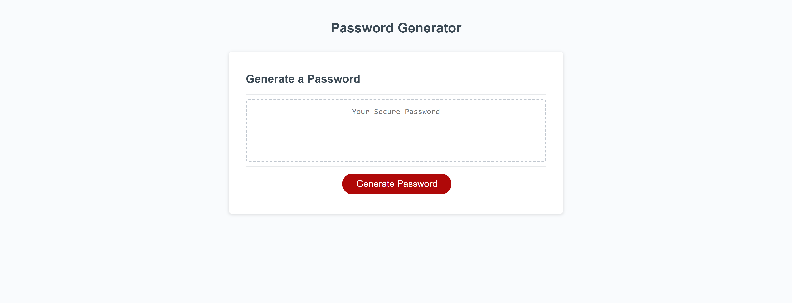

# Password Gen Random

Password Gen Random is software which generates a users personlized passwords. Giving users ultimate control in character types and length of passwords.

## Languages Used:

languages used whitin the software are HTML (Hyper Text Mark Up Language), CSS (Cascading Style Sheets), and Javascript.

## Starter Code:

The starter code for this project can be cloned from

https://github.com/coding-boot-camp/friendly-parakeet

## Credits:

Big shout out to the one and only

https://github.com/Xandromus

## Image of Password Gen Random

** https://delshadmohammed.github.io/password-gen/ **

Please press above link to see the action
